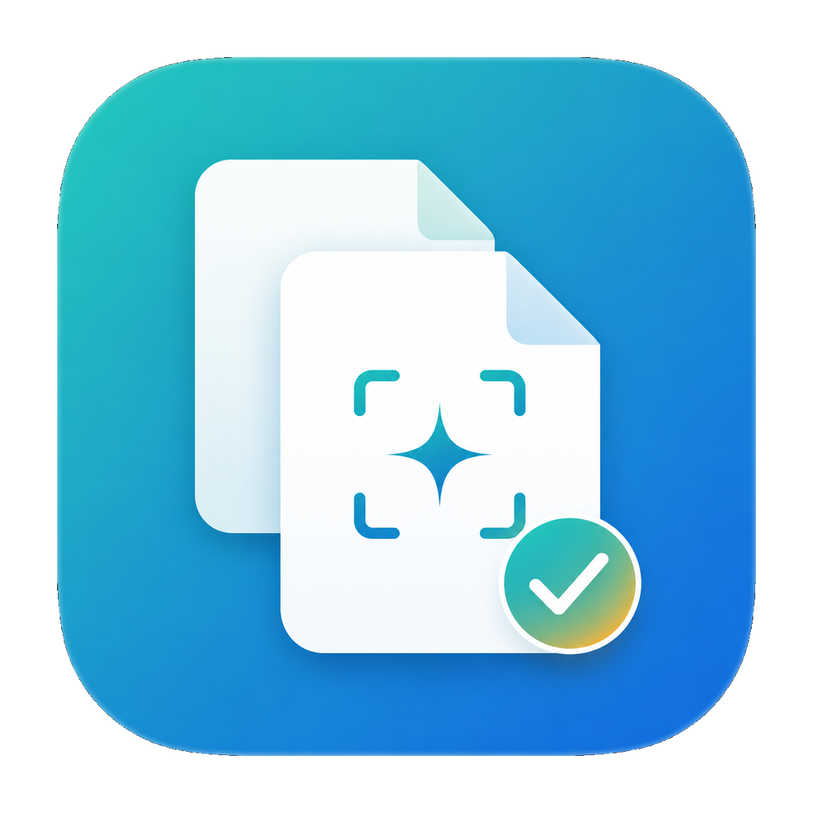

# FastDup - Native macOS Duplicate File Finder

[](https://developer.apple.com/macos/)
[](https://developer.apple.com/xcode/swiftui/)
[](LICENSE)

**FastDup** is a lightweight, native macOS application built with SwiftUI for finding and managing duplicate files in large local folders and mounted NAS/network volumes. It's designed for practical, fast cleanup with a focus on user safety and performance.

<p align="center">
  
</p>

## 🚀 Quick Start

### Download & Install
1. **Download the latest release**: [FastDup-1.1.5-macOS.zip](https://github.com/lynxistudio/fastdup/releases/latest)
2. **Unzip** the downloaded file
3. **Move** `FastDup.app` to your `Applications` folder
4. **First launch**: Right-click the app and select "Open" (macOS may require this for ad-hoc signed apps)

> **Note**: FastDup is currently ad-hoc signed but not Apple notarized. This is common for open-source macOS apps. If macOS blocks the first launch, right-click `FastDup.app`, choose `Open`, then confirm once.

## ✨ Key Features

### 🔍 Smart Duplicate Detection
- **6 detection dimensions**: File size, extension, exact filename, MD5 hash, SHA1 hash, image resolution, video duration
- **6 presets**: Fast Scan, Exact Duplicates, Same Name & Size, Same Name Only, Same Size Only, Duplicate Images
- **SQLite cache**: Scan results are cached for incremental scanning

### 🛡️ Safe & User-Friendly
- **Safe deletion**: Moves selected duplicates to Trash, preserving at least one original file per group
- **Network volume support**: Special handling for NAS/mounted volumes
- **Quick Look preview**: Preview files directly from the results list
- **Real-time updates**: See results as they're discovered during scanning

### ⚡ Performance Optimized
- **Metadata-first scanning**: Fast initial scan using file metadata
- **Background processing**: Scanning continues while you browse results
- **Native SwiftUI**: Smooth, responsive macOS-native interface

## 📸 Screenshots

*(Screenshots will be added here after first release)*

| Main Interface | Scan Results | Quick Look Preview |
|:--------------:|:------------:|:------------------:|
| *Coming soon*  | *Coming soon*| *Coming soon*      |

## 🛠️ For Developers

### Build from Source

```bash
# Clone the repository
git clone https://github.com/lynxistudio/fastdup.git
cd fastdup

# Build using the provided script
./scripts/build_app.sh
```

The built app will be available as `FastDup.app` in the project root.

### Manual Build

```bash
swiftc -sdk "$(xcrun --show-sdk-path --sdk macosx)" \
  -target arm64-apple-macos14.0 \
  -framework SwiftUI \
  -framework AppKit \
  -framework Foundation \
  -framework AVFoundation \
  -framework CoreGraphics \
  -framework ImageIO \
  -framework UniformTypeIdentifiers \
  -framework QuickLookUI \
  -framework CoreServices \
  -framework Quartz \
  FastDupApp.swift Models/*.swift Services/*.swift \
  -lsqlite3 \
  -o FastDup.app/Contents/MacOS/FastDup
```

### Project Structure

```
FastDup/
├── Assets/
│   ├── FastDupIcon-1024.png      # App icon source
│   └── screenshots/              # App screenshots
├── FastDupApp.swift              # Main app entry point
├── Models/                       # Data models
│   ├── AppState.swift
│   ├── DuplicateGroup.swift
│   ├── FileItem.swift
│   └── SearchRule.swift
├── Services/                     # Core services
│   ├── DatabaseManager.swift     # SQLite operations
│   └── FileScanner.swift         # File scanning engine
├── scripts/
│   └── build_app.sh             # Complete build script
├── dist/                         # Release builds
└── CHANGELOG.md                 # Version history
```

## 📋 Requirements

- **macOS 14.0** or later
- **Xcode Command Line Tools** (for building from source)
- **Swift toolchain** (included with Xcode)

## 🔧 Technical Details

- **Language**: Swift 5.9+
- **UI Framework**: SwiftUI with AppKit integration
- **Database**: SQLite3 with WAL mode
- **Architecture**: Apple Silicon (arm64) native
- **Dependencies**: Zero external dependencies, uses only macOS frameworks

## 📝 Notes

- **Data storage**: The app stores its SQLite scan database in `~/Library/Application Support/com.fastdup.app/`
- **Security**: MD5/SHA1 are used only for file fingerprinting, not for cryptographic security
- **Git ignore**: Build artifacts, local databases, and generated files are properly ignored
- **Notarization**: Currently ad-hoc signed; Apple Developer ID notarization is planned for future releases

## 📄 License

MIT License. See [LICENSE](LICENSE) for full details.

Copyright © 2026 [Lynxistudio](https://lynxistudio.com) - All rights reserved.

## 🤝 Contributing

Contributions are welcome! Please feel free to submit a Pull Request.

1. Fork the repository
2. Create your feature branch (`git checkout -b feature/amazing-feature`)
3. Commit your changes (`git commit -m 'Add some amazing feature'`)
4. Push to the branch (`git push origin feature/amazing-feature`)
5. Open a Pull Request

## 📚 Documentation

- [CHANGELOG.md](CHANGELOG.md) - Release history and changes
- Issues - Report bugs or request features

---

**FastDup** - Keep your storage clean, fast, and safe.
